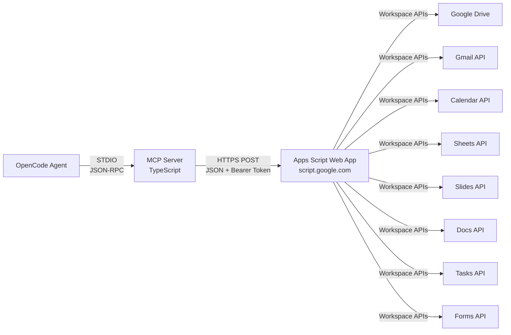
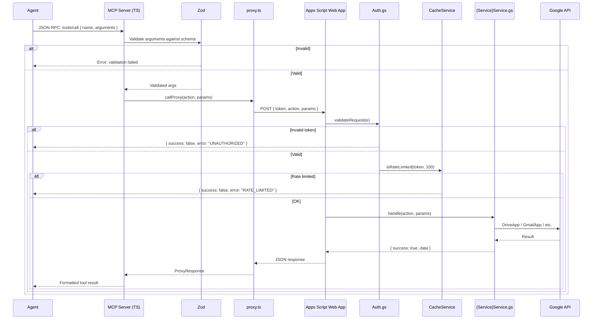

# Architecture Overview

How the 190 tools flow from an agent prompt to a Google Workspace mutation &mdash; and back.

---

## High-Level Flow



| Layer | Technology | Responsibility |
|-------|-----------|----------------|
| **Agent** | OpenCode / LLM | Calls MCP tools via JSON-RPC over STDIO |
| **MCP Server** | TypeScript (Node 20+) | Registers tools with Zod schemas, validates input, calls proxy via HTTPS |
| **Apps Script Proxy** | Google Apps Script (V8) | Authenticates via bearer token, rate-limits, dispatches to Workspace APIs |
| **Workspace APIs** | `DriveApp`, `GmailApp`, `CalendarApp`, etc. | Perform the actual CRUD operations as the deploying user |

---

## Package Structure

```
workspace-lite/
├── shared/                     # Shared TypeScript package
│   └── src/
│       ├── schemas.ts          # Zod schemas for all services
│       ├── response.ts         # ProxyResponse interface, format helpers
│       └── index.ts            # Barrel exports
├── packages/
│   ├── drive/                  # 44 tools
│   │   ├── src/
│   │   │   ├── index.ts        # MCP server entry: McpServer + StdioServerTransport
│   │   │   ├── proxy.ts        # fetch() to Apps Script with token auth, 30s timeout
│   │   │   └── tools/          # drive-list.ts, drive-read.ts, drive-write.ts, drive-manage.ts, drive-batch.ts
│   │   └── apps-script/        # Auth.gs, Code.gs, Response.gs, DriveService.gs, .clasp.json
│   ├── gmail/                  # 39 tools
│   ├── calendar/               # 15 tools
│   ├── sheets/                 # 27 tools
│   ├── slides/                 # 19 tools
│   ├── docs/                   # 17 tools
│   ├── tasks/                  # 13 tools
│   └── forms/                  # 16 tools
├── scripts/
│   └── setup.sh                # One-shot setup: clasp login → create → push → deploy guide → bootstrap
├── skills/
│   └── google-workspace/       # OpenCode agent skill
│       ├── SKILL.md            # Fast-start index, tool catalog pointers, safety rules
│       └── references/         # tool-catalog.md, workflows.md, rules.md
├── tsconfig.base.json           # Shared TypeScript config
├── package.json                 # Workspace root: build, typecheck, dev scripts
└── mkdocs.yml                   # Documentation config
```

Each service package follows an identical structure:

| File | Purpose |
|------|---------|
| `src/index.ts` | Creates an `McpServer`, registers tools, connects via `StdioServerTransport` |
| `src/proxy.ts` | Reads env vars, exports `callProxy(action, params)` that POSTs to the Apps Script web app |
| `src/tools/` | Tool registration functions, organized by domain (read, write, manage, list, batch) |
| `apps-script/Code.gs` | `doGet` (bootstrap + health), `doPost` (validate, rate-limit, dispatch) |
| `apps-script/Auth.gs` | Token generation (48-char random), bootstrapping, validation, rate limiting |
| `apps-script/Response.gs` | `ok()`, `err()`, `respond()` helpers for structured JSON responses |
| `apps-script/{Service}Service.gs` | Action dispatcher: `handle(action, params)` with large `switch` statement |

---

## Zod Validation Layer

Every tool parameter is validated by Zod schemas in `shared/src/schemas.ts` before the proxy call.

```typescript
// Example: file creation schema (shared/src/schemas.ts:38-43)
export const fileCreateSchema = {
  name: z.string().describe('File name.'),
  content: z.string().describe('File content.'),
  mimeType: z.string().default('text/plain').describe('MIME type.'),
  parentId: z.string().optional().describe('Parent folder ID.'),
}
```

Validation happens at the MCP Server layer **before** the request reaches the Apps Script proxy:

```
Agent call → McpServer tool handler
                → Zod validates args against schema
                    → Invalid? → return error to agent
                    → Valid?   → callProxy(action, validatedArgs)
                                    → fetch(PROXY_URL, { body: JSON.stringify({...}) })
```

Key design decisions:

| Decision | Rationale |
|----------|-----------|
| Zod on the TypeScript side, not in Apps Script | Type-safe validation before network call. Reduces wasted executions. |
| Regex on IDs (`/^[a-zA-Z0-9_-]+$/`) | Prevents injection attacks at the validation layer |
| `min`/`max` on counts and sizes | Protects against oversized requests. Sheets batch values: unlimited rows; Gmail body: max 100KB |
| `.default()` for optional fields | Simpler agent calls; sensible defaults for pagination, MIME types, positioning |

---

## Auth Flow

The authentication model eliminates OAuth from every API call by leveraging Apps Script&rsquo;s execution identity.

### One-Time Bootstrap

```
                 ┌──────────┐
                 │  Admin   │
                 └────┬─────┘
                      │ GET ?bootstrap=1
                      ▼
┌─────────────────────────────────────────┐
│  Apps Script Web App (Code.gs:doGet)    │
│                                         │
│  1. Check isBootstrapped() → false      │
│  2. markBootstrapped() → set property   │
│  3. getOrCreateToken()                  │
│     → Generate 48-char random string    │
│     → Store in ScriptProperties         │
│  4. Return { token: "abc...xyz" }       │
└─────────────────────────────────────────┘
                      │
                      ▼
              Save as env var
              GOOGLE_WORKSPACE_*_PROXY_TOKEN
```

### Per-Request Auth

```
┌──────────────┐     POST /exec
│  MCP Server   │─────{ token, action, params }───►┌──────────────────────────┐
│  (proxy.ts)   │                                   │  Apps Script (Code.gs)  │
└──────────────┘                                   │  doPost(e):              │
                                                    │  1. validateRequest(e)  │
                                                    │     → Parse token from  │
                                                    │       JSON body          │
                                                    │     → Compare against   │
                                                    │       stored token       │
                                                    │  2. isRateLimited()     │
                                                    │  3. Service.handle()    │
                                                    │  4. respond(result)     │
                                                    └──────────────────────────┘
```

| Property | Value |
|----------|-------|
| Token format | UUID generated by `Utilities.getUuid()` |
| Token storage | `PropertiesService.getScriptProperties()` &mdash; persists across deployments |
| Token extracted from | JSON body only (`body.token`) |
| Bootstrap one-shot | `markBootstrapped()` prevents re-bootstrap; returns `FORBIDDEN` on subsequent calls |
| Bootstrap setup key | `setupKey` must match the generated, untracked `BootstrapSecret.gs` value |

!!! warning "Token security"
    The token is a shared secret. Anyone with the token and deployment URL can call your web app as you. Store tokens in environment variables, never commit `.env` to version control.

---

## Rate Limiting

Each Apps Script proxy enforces weighted request limits using `CacheService.getScriptCache()`.

```javascript
function isRateLimited(token, maxWeight, weight) {
  var cache = CacheService.getScriptCache()
  var key = 'rate_' + token
  var count = parseInt(cache.get(key) || '0', 10)
  if (count + weight > maxWeight) return true
  cache.put(key, String(count + weight), 60)  // 60-second TTL
  return false
}
```

| Aspect | Detail |
|--------|--------|
| Rate limit | 100 weighted units per 60-second window |
| Per proxy | Separate rate limit for each of the 8 services |
| Response on limit | `{ success: false, error: { code: "RATE_LIMITED", message: "Too many requests. Try again in 60 seconds." } }` |
| Implementation | `CacheService` &mdash; zero external dependencies, works across all instances of a deployment |

!!! tip "Handling rate limits"
    The MCP server will throw an error on rate-limited responses. The agent should retry after 60 seconds. For high-throughput workflows, use `{service}_batch` tools to pack up to 20 operations into a single request, but note that a batch costs the sum of its child action weights.

---

## Batch Operations

Every service exposes a `{service}_batch` tool that executes up to 20 operations in a single HTTPS round-trip.

### How Batch Works

```
Agent calls sheets_batch({ spreadsheetId, operations: [op1, op2, ..., opN] })
  │
  ▼
MCP Server: validates N ≤ 20, passes to proxy
  │
  ▼
Apps Script: forEach operation → handle(action, params) → collect result
  │
  ▼
Response: { success: true, results: [
  { action: "rangeWrite", success: true, data: {...} },
  { action: "rangeFormat", success: true },
  { action: "chartCreate", success: false, error: { code: "BAD_REQUEST", message: "..." } },
] }
```

| Property | Detail |
|----------|--------|
| Max operations | 20 per batch (enforced by Zod `.max(20)`) |
| Execution | Sequential within the Apps Script proxy (not parallel) |
| Error handling | Per-operation error collection. One failed operation does not stop the batch. |
| Response format | `{ success: true, results: [{ action, success, data?, error? }] }` |
| Use case | Compound spreadsheet setup, multi-slide deck creation, multi-file Drive operations |

### Batch vs. Individual Calls

| Aspect | Individual tools | Batch tool |
|--------|-----------------|------------|
| Round-trips | 1 per operation | 1 total |
| Error isolation | Each call independent | Errors collected per-op |
| Rate limit impact | Counts as N requests | Counts as 1 request |
| Atomicity | Each call is isolated | No transaction guarantees |

---

## Proxy Request Lifecycle

A single tool call goes through this pipeline:



---

## Why Apps Script?

| Benefit | Detail |
|---------|--------|
| **No OAuth per call** | Apps Script web apps run as `USER_DEPLOYING`. Your identity, your permissions. No service accounts, no refresh tokens, no consent screens after deploy. |
| **Native API access** | `DriveApp`, `GmailApp`, `CalendarApp`, `SpreadsheetApp`, `SlidesApp`, `DocumentApp` &mdash; first-class Google APIs with no REST overhead |
| **Free tier** | Apps Script is free. 20,000 URL Fetch calls/day. 6-min execution per request. |
| **HTTPS transport** | Web apps are served over HTTPS with Google-managed certificates |
| **No infrastructure** | No servers to manage. Google hosts the proxy. |

---

## Next Steps

| Topic | Link |
|-------|------|
| Security model deep-dive | [Security](security.md) |
| Drive service architecture | [Drive Service](../services/drive.md) |
| Batch API reference | [Batch Operations](../api/batch.md) |
| Quotas and limits | [Quotas &amp; Limits](../operations/quotas.md) |
