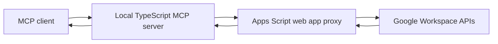

---
hide:
  - navigation
  - toc
---

# workspace-lite

<p class="subtitle">Google Workspace MCP servers through per-service Apps Script proxies. Drive, Gmail, Calendar, Sheets, Slides, Docs, Tasks, and Forms in one agent-ready local toolkit.</p>

[Get started :material-arrow-right:](getting-started/installation.md){ .md-button .md-button--primary }
[Review the architecture :material-arrow-right:](architecture/overview.md){ .md-button }

<div class="workspace-stats" markdown>

<div class="stat" markdown>
  <div class="stat-value">218</div>
  <div class="stat-label">MCP tools</div>
</div>

<div class="stat" markdown>
  <div class="stat-value">8</div>
  <div class="stat-label">Workspace services</div>
</div>

<div class="stat" markdown>
  <div class="stat-value">20 ops</div>
  <div class="stat-label">Per batch call</div>
</div>

<div class="stat" markdown>
  <div class="stat-value">Apps Script</div>
  <div class="stat-label">User-owned proxy runtime</div>
</div>

</div>

## What It Is

`workspace-lite` lets agents work with Google Workspace through local
TypeScript MCP servers. The MCP servers validate tool input and send signed
requests to small Apps Script web apps. Apps Script then calls Google APIs as
the deploying user.

That split keeps the local agent experience simple while preserving the
permission model users already understand in Google Workspace.



## Core Capabilities

<div class="grid cards" markdown>

-   :material-google-drive:{ .lg } **Drive**

    ---

    Files, folders, permissions, comments, replies, revisions, shared drives,
    changes, and batch file workflows.

    [:octicons-arrow-right-24: Drive guide](services/drive.md)

-   :material-gmail:{ .lg } **Gmail**

    ---

    Search, read, labels, drafts, replies, forwarding, filters, vacation
    responder, and explicit send review.

    [:octicons-arrow-right-24: Gmail guide](services/gmail.md)

-   :material-calendar:{ .lg } **Calendar**

    ---

    Events, free/busy checks, calendar lists, settings, Meet links, RSVP,
    colors, moves, and batch scheduling.

    [:octicons-arrow-right-24: Calendar guide](services/calendar.md)

-   :material-table:{ .lg } **Sheets**

    ---

    Values, formulas, formatting, charts, sorting, validations, protections,
    row operations, and spreadsheet setup batches.

    [:octicons-arrow-right-24: Sheets guide](services/sheets.md)

-   :material-presentation:{ .lg } **Slides & Docs**

    ---

    Presentations, slide content, notes, images, tables, document structure,
    formatting, bookmarks, and named ranges.

    [:octicons-arrow-right-24: Slides guide](services/slides.md)
    [:octicons-arrow-right-24: Docs guide](services/docs.md)

-   :material-format-list-checks:{ .lg } **Tasks & Forms**

    ---

    Task lists, tasks, moves, completed-task cleanup, form settings, items,
    destinations, responses, and response deletion.

    [:octicons-arrow-right-24: Tasks guide](services/tasks.md)
    [:octicons-arrow-right-24: Forms guide](services/forms.md)

</div>

## Find Your Path

| Role | Goal | Start here |
|---|---|---|
| **User** | Install and run the first tool | [Installation](getting-started/installation.md) -> [Quickstart](getting-started/quickstart.md) |
| **Agent author** | Use tools safely in repeatable workflows | [Agent Skill Overview](skill/overview.md) -> [Agent Skill Workflows](skill/workflows.md) |
| **Operator** | Deploy, refresh, and troubleshoot Apps Script proxies | [Setup Script](getting-started/setup-script.md) -> [Troubleshooting](operations/troubleshooting.md) |
| **Security reviewer** | Understand auth, input policy, risky actions, and response contracts | [Security Model](architecture/security.md) -> [Input Policies](operations/input-policies.md) |
| **Contributor** | Change code, docs, validators, or release automation | [Contributing](project/contributing.md) -> [Release Process](project/release-process.md) |

## Install

=== "Preview"

    ```bash
    git clone https://github.com/joe-broadhead/workspace-lite.git
    cd workspace-lite
    ./scripts/setup.sh --dry-run
    ```

=== "Deploy"

    ```bash
    git clone https://github.com/joe-broadhead/workspace-lite.git
    cd workspace-lite
    ./scripts/setup.sh
    ```

=== "Agent skills"

    ```bash
    mkdir -p ~/.config/opencode/skills
    ln -sf "$(pwd)/skills/google-workspace" ~/.config/opencode/skills/google-workspace
    ln -sf "$(pwd)/skills/workspace-lite-installer" ~/.config/opencode/skills/workspace-lite-installer
    ```

The setup script creates or reuses one Apps Script project per service, pushes
proxy code, guides the manual web app deployment step, bootstraps tokens, and
prints MCP config.

!!! important "Google review step"
    The first Apps Script web app deployment and OAuth scope review happen in
    Google's UI. Agents can help with local commands, but the user should review
    scopes and deployment settings directly.

## Public Release Readiness

This repository includes CI, strict docs builds, release workflow automation,
contributor guidance, security policy, changelog, and deterministic validators
for manifests, response contracts, mutation safety, input policy, and registry
architecture.

[:octicons-arrow-right-24: Public release checklist](project/public-release.md)
