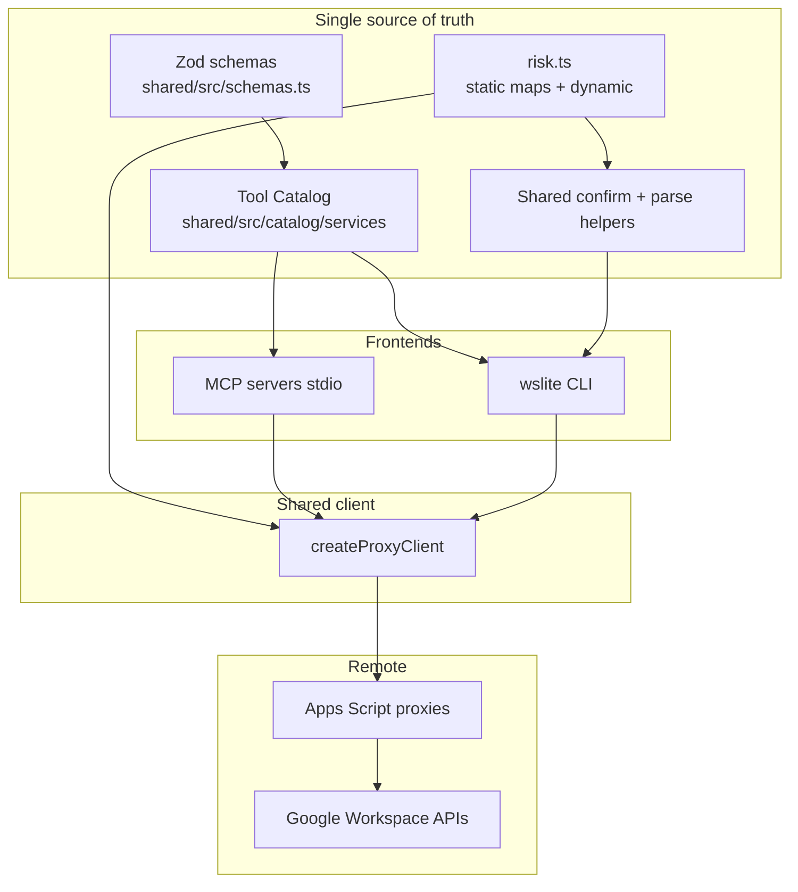

# CLI with Full Tool Parity for workspace-lite

| Field | Value |
|-------|--------|
| **Document** | Full design: CLI with full tool parity |
| **Author** | TBD |
| **Date** | 2026-07-16 (rev 4 locked) |
| **Status** | Ready for implementation / Approved |
| **Repo** | `/Users/joe/Documents/Github/workspace-lite` (`joe-broadhead/workspace-lite`) |
| **Baseline** | `master` @ `60c58a7` |
| **Scope** | New CLI package + tool catalog SSOT; no second Google auth stack |
| **Revision** | 4 — open questions locked |

---

## Overview

`workspace-lite` today exposes **218 Google Workspace tools** through eight local TypeScript MCP servers that POST to Apps Script web app proxies. Agents and MCP clients already share one execution path (`createProxyClient` → HTTPS bearer token → Policy/Auth → Workspace APIs). Humans and scripts have no first-class frontend: operators either drive MCP through OpenCode or craft raw proxy POSTs.

This design introduces a **catalog-driven CLI** that is a second frontend over the **same** proxy client, Zod schemas, risk classification, and confirmation semantics—not a parallel implementation. Tool metadata (name, description, service, proxy action, schema, formatters, batch eligibility) becomes a **single source of truth** consumed by both MCP registration and CLI command generation. Static/dynamic **client token risk** lives in one module (`shared/src/catalog/risk.ts`), not duplicated on every tool. Full parity means equivalent **actions, parameters, auth, errors, and confirm gates**; UX may differ (flags/tables vs JSON-RPC/`content[]`).

The CLI is complementary to MCP, not a replacement. Setup (`scripts/setup.sh`, clasp deploy, bootstrap) remains unchanged; the CLI may later wrap operator convenience commands without rewriting clasp.

**Migration principle:** per-service **port + MCP flip + delete old tools** in one PR (vertical slice). No long-lived dual-write of 218 tools. CLI gains surface as each service flips; full 218-tool parity is the end state, not the first CLI MVP acceptance gate.

---

## Background & Motivation

### Current architecture (verified)

```text
OpenCode / MCP client
  ↔ local TypeScript MCP server (stdio)   packages/<service>/src/index.ts
  ↔ Apps Script web app (HTTPS + token)   packages/<service>/apps-script/
  ↔ Google APIs as USER_DEPLOYING
```

| Layer | Location | Role |
|-------|----------|------|
| Service registry | `config/service-registry.json` | Service keys, tool counts, OAuth scopes, token env names |
| Shared client | `shared/src/proxy-client.ts` | `createProxyClient(service)`, token class routing, 30s timeout |
| Schemas | `shared/src/schemas.ts` (~1661 lines) | Zod input shapes, `confirm`, `idempotencyKey` |
| Response | `shared/src/response.ts` | `ProxyResponse`, `formatResponse`, `formatList`, truncation |
| Tool helper | `shared/src/tool-helpers.ts` | `ToolDef` + `registerTool` (~55 call sites) |
| Raw tools | `packages/*/src/tools/*.ts` | `server.tool(...)` (~163 call sites) with custom formatters |
| Policy | `packages/*/apps-script/Policy.gs` | Confirm for send/share/destructive; allowlists; rate weights |
| Auth | `shared/apps-script/Auth.gs` (mirrored) | Bearer tokens + class-scoped tokens |
| Validators | `scripts/validate-architecture.mjs`, `registry-helpers.mjs` | Auth/Response identity, tool↔action mappings, counts |
| Tests | `tests/tool-registration.test.ts` | Expected counts, docs/skill catalog alignment |
| MCP bins | e.g. `google-workspace-drive` | Per-service stdio servers |

Tool surface by service: drive 44, gmail 39, calendar 22, sheets 33, slides 25, docs 26, tasks 13, forms 16 (**218** total).

### Pain points

1. **No human/script CLI** — operators debugging proxy responses or automating outside OpenCode lack a supported interface.
2. **Dual registration styles** — `registerTool` vs hand-written `server.tool` handlers make discovery and mechanical generation hard; `toolActionMappings()` already regex-parses both patterns in `scripts/registry-helpers.mjs`.
3. **Metadata fragmentation** — name/description/schema/action live in TS tool files; risk class lives in Apps Script `ACTION_POLICIES` and partially in `ACTION_TOKEN_CLASSES` in `proxy-client.ts`; docs and `skills/google-workspace/references/tool-catalog.md` are kept in sync by tests, not generated from one catalog.
4. **Docs vs code security default** — `docs/architecture/security.md` states primary token defaults to `read,draft`, but `DEFAULT_AUTH_TOKEN_CLASSES` in Auth.gs is `read,draft,write,destructive,share,send`. Any CLI design must not paper over this: **server policy is the real gate**, and operators must understand class tokens vs primary token breadth.

### Why not a thin wrapper

A one-off Commander wrapper that hardcodes 218 commands would:

- Drift from MCP tool definitions within weeks
- Bypass or reimplement Zod validation inconsistently
- Duplicate confirm/idempotency UX without shared risk metadata
- Force dual maintenance of every new tool

First principles require **catalog → MCP + CLI**, not CLI bolted onto today’s handlers.

### Batch confirm semantics (verified at baseline)

Critical for CLI design — verified in `packages/*/apps-script/*Service.gs` + `Policy.gs`:

1. Outer action `batch` has `ACTION_POLICIES.batch.class = 'read'`.
2. `runBatch` calls `handleFn(op.action, op.params || {})` per operation.
3. Each nested call runs `enforceActionPolicy(action, params, …)` which requires **`params.confirm === true`** on that op when resolved class is send/share/destructive.
4. **Top-level** `params.confirm` on the batch request is **not** consulted for nested ops.
5. Client `batchTokenClass` may return `'admin'` when multiple high-risk classes mix — that only affects **token selection**, not Policy confirm.

Therefore CLI `--yes` / prompts must inject `confirm: true` into **each gated operation’s `params`**, not only outer batch args.

---

## Goals & Non-Goals

### Goals

1. **Full tool parity architecture** — every registered MCP tool is invokable from the CLI with equivalent semantics (params, auth, confirm, errors, batch partial results). End-state after all service flips; CLI MVP may ship with a subset.
2. **Single source of truth** for tool definitions consumed by MCP registration and CLI — no long dual-write window.
3. **Incremental migration** via per-service vertical slices (port + flip + delete) without a monorepo-wide big-bang.
4. **Navigable UX** for 218 tools (service subcommands, generated help, generic call).
5. **Human + machine output** (`--json`, tables/text, structured exit codes).
6. **Safety non-regression** — same confirm gates including **per-op batch confirm**; `--yes` only injects client-side `confirm: true`; Policy.gs remains authoritative.
7. **Testable parity** — registration tests, invoke-path parity (CLI vs MCP → same `callProxy` args), contract/golden CLI tests (prefer `--json`).
8. **Distributable package** — npm workspace package with bin `wslite` (not `wsl` or `gws`).
9. **Incremental PR plan** — independently reviewable vertical slices.

### Non-Goals

- Replacing MCP servers or OpenCode integration.
- A second OAuth / Google auth stack (no service accounts, no gcloud ADC path for Workspace calls).
- Rewriting clasp setup, bootstrap, or Apps Script deployment in the first ship of the CLI.
- Day-one hand-crafted “pretty” UX sugar for every flag of every tool (architecture must allow progressive sugar).
- Multi-user SaaS identity; still one deploying-user proxy per service.
- Changing Apps Script action implementations (except optional metadata exports if needed later).
- Publishing shared/cli to public npm before CLI GA (monorepo-local only for now; revisit after GA — K16).
- Byte-identical CLI human text vs MCP `content[]` formatters.

---

## Key Decisions

| # | Decision | Rationale |
|---|----------|-----------|
| K1 | **Catalog-first tool definitions** in TypeScript under `shared/src/catalog/` as the SSOT for name/description/schema/action/formatters | Regex scraping of tool files is fragile; Zod schemas already live in shared; catalog imports them by symbol |
| K2 | **CLI is a second frontend over `createProxyClient`** | Reuses token class selection, env vars, 30s timeout, response validation; no dual auth |
| K3 | **MCP remains primary agent interface**; CLI for humans/scripts/CI | Complements MCP; does not fork agent skill workflows |
| K4 | **Binary name `wslite` (primary), package `@workspace-lite/cli`**; optional dual bin `workspace-lite` | Avoids `wsl` (Windows Subsystem for Linux) and `gws` (existing npm package / other tooling) |
| K5 | **Parity = semantic equivalence, not byte-identical UX** | Flags/tables vs MCP `content[]` expected; same action/params/errors/confirm |
| K6 | **Per-service port + MCP flip + delete old tools in one PR** | Eliminates long dual-write; each service becomes catalog SSOT when merged; no global dual-registration flag |
| K7 | **Confirm UX: interactive prompt or `--yes` only; never auto-generate `--confirm`** | Schemas include `confirm`; CLI owns approval UX; MCP agents still pass `confirm` in JSON |
| K8 | **Exit codes: 0 success, 1 hard fail, 2 confirm, 3 partial (incl. all-ops-failed batch), 4 usage** | Scriptable automation; all-failed batch still `success: true` + `partial` from proxy → exit 3 |
| K9 | **Do not invent CLI-only tools** that skip the proxy | Every command maps to a catalog tool → proxy action |
| K10 | **Generic escape hatch: `wslite call` with strict schema rules** | `--tool` when ambiguous; refuse unknown actions unless gated `--raw`; always run confirm resolution |
| K11 | **Client risk SSOT is only `catalog/risk.ts`** (maps + dynamic rules). `ToolSpec` does **not** store hand-authored `riskClass`; docs/help derive via `staticRiskClass(service, action)` | Prevents triple maintenance vs Policy.gs / token maps |
| K12 | **Honest security model in docs is a GA dependency** | Document Auth.gs full default classes; fix architecture/ops security docs + AGENTS.md |
| K13 | **CLI framework: Commander** | Mature subcommands/help; lock for PR 4 implementers |
| K14 | **Batch confirm injects into each gated op’s `params.confirm`** | Matches Policy.gs `handleFn(op.action, op.params)` — outer batch confirm is ignored |
| K15 | **Shared execute path for confirm + parse** used by CLI; MCP uses extended `registerTool` | Invoke-parity tests mock `ProxyClient` for both paths |
| K16 | **Monorepo-local distribution only for now**; do not publish `@workspace-lite/shared` or `@workspace-lite/cli` to public npm before CLI GA | Avoids private-package publish chicken-and-egg; **revisit public npm after CLI GA** (final) |
| K17 | **Config: process env only in v1** (optional dotenv load of repo `.env`); no `~/.config` token file | Matches MCP; fewer secret-on-disk paths |
| K18 | **Multi-action tools declare static `actions[]` plus runtime `resolveAction`** | Enables `wslite call`, validators, and mappings without probing `resolveAction`; replaces `drive_list_folders` special case |
| K19 | **Typecheck paths for `shared/src/catalog/**` are required in PR 2** | Current `@workspace-lite/shared/*` → `shared/src/*.ts` cannot resolve nested catalog modules |
| K20 | **Interactive batch confirm UI: summary only** — op index, action, risk class; **no full params** | Avoids leaking PII (recipients, bodies, file content) into the terminal prompt |
| K21 | **`--raw` on `wslite call` is gated by `WSLITE_ALLOW_RAW=1`** | Useful for debugging uncatalogued proxy actions; not advertised in default help; still runs confirm resolution |

---

## Definition of MCP ↔ CLI Parity

### What parity **requires**

| Dimension | MCP | CLI | Parity rule |
|-----------|-----|-----|-------------|
| Tool identity | `drive_get_file` | `wslite drive get-file` | 1:1 via `mcpNameToCliPath`; MCP name in help |
| Proxy action | `callProxy(action, args)` | Same | Identical action string after `resolveAction` |
| Parameters | Zod schema on tool | Same schema after `parseCliArgs` coercion | Same required/optional fields, defaults, refine rules |
| Auth | Env tokens via `createProxyClient` | Same env vars | Same token class selection |
| Confirmation (single) | Agent passes `confirm: true` | Prompt / `--yes` sets top-level `confirm: true` | Server Policy enforces |
| Confirmation (batch) | Agent sets each op `params.confirm` | CLI injects into **each** gated op `params` | Outer batch `confirm` ignored by server |
| Idempotency | `idempotencyKey` in schema | `--idempotency-key` flag | Same field name in proxy params |
| Errors | codes / messages / correlationId | stderr + exit + optional JSON | Same `error.code` / `message` / `correlationId` |
| Batch | Per-op results, `partial: true` | Same envelope; exit 3 if partial | Same sequential semantics |
| Dynamic risk | `risk.ts` via proxy-client | Same `resolveRiskClass` | Shared implementation |
| Coverage (end state) | 218 tools | 218 tools | Catalog length === sum(registry.toolCount) |

### What parity **does not** require

- Identical human-readable text (MCP custom formatters vs CLI tables).
- MCP-style `content: [{ type: 'text', text }]` on stdout.
- Flag sugar for every nested batch field (batch uses `--operations-file` / `--params-json`).
- CLI human snapshots matching MCP text (goldens use `--json` primarily).

### Parity test oracle (non-tautological)

```text
1. Registration: CaptureServer(registerCatalogTools(service)) names/schemas
   match catalog module for that service; count === registry.toolCount

2. Invoke matrix (fixture table, mock ProxyClient):
   For each fixture { tool, rawCliArgs | mcpArgs }:
     CLI: parseCliArgs → applyConfirmPolicy → callProxy(action, params)
     MCP: handler(args) → callProxy(action, params)
     Assert identical (service, action, params) including batch per-op confirm

3. External oracles (survive cutover):
   catalog.length === sum(service-registry toolCount)
   every tool name appears in docs/services/*.md and skill tool-catalog
   risk.ts static class vs ACTION_POLICIES (validator)

4. Do NOT require CLI human formatter text === MCP content[] text
```

---

## Proposed Design

### High-level architecture



### Package placement

```text
workspace-lite/
├── shared/
│   └── src/
│       ├── catalog/
│       │   ├── types.ts
│       │   ├── risk.ts                 # ONLY client static/dynamic risk SSOT
│       │   ├── register-from-catalog.ts
│       │   ├── parse-cli-args.ts       # coercion + Zod (shared, used by CLI)
│       │   ├── confirm-policy.ts       # single + batch confirm injection
│       │   ├── naming.ts               # mcpNameToCliPath
│       │   ├── services/
│       │   │   ├── drive.ts            # after drive flip PR
│       │   │   ├── gmail.ts
│       │   │   └── ...
│       │   └── index.ts
│       ├── proxy-client.ts             # imports risk.ts; optional diagnostics hook
│       ├── schemas.ts
│       ├── response.ts
│       └── tool-helpers.ts             # extended ToolDef / registerTool
├── packages/
│   ├── <service>/src/
│   │   ├── index.ts                    # registerCatalogTools after flip
│   │   ├── proxy.ts                    # keep thin re-export OR delete after flip
│   │   └── tools/                      # DELETED in same PR as flip
│   └── cli/
│       ├── package.json                # bin: wslite, workspace-lite
│       └── src/
│           ├── index.ts
│           ├── program.ts              # Commander, built from catalog
│           ├── execute.ts              # uses confirm-policy + createProxyClient
│           ├── render.ts
│           ├── exit-codes.ts
│           └── commands/{call,list-tools,doctor}.ts
├── config/service-registry.json
├── scripts/
│   ├── validate-architecture.mjs       # risk path tokens updated in risk-extract PR
│   └── registry-helpers.mjs            # toolActionMappings from catalog post-flip
└── tests/
    ├── tool-registration.test.ts
    ├── catalog-parity.test.ts
    ├── invoke-parity.test.ts           # CLI vs MCP callProxy matrix
    ├── risk-resolution.test.ts
    └── cli/*.test.ts                   # included by updated test glob
```

### Catalog schema (TypeScript types)

```typescript
// shared/src/catalog/types.ts

import type { ZodTypeAny } from 'zod'
import type { ProxyResponse } from '../response.js'
import type { TokenClass } from './risk.js' // client routing class only

export type ServiceKey =
  | 'drive' | 'gmail' | 'calendar' | 'sheets'
  | 'slides' | 'docs' | 'tasks' | 'forms'

/**
 * How the tool maps Zod fields to CLI flags.
 * Default: kebab-case of schema keys; booleans as --flag / --no-flag.
 * Note: schema key `confirm` is NEVER emitted as a CLI flag (see Confirm rules).
 */
export interface CliFlagHints {
  /** Override flag name for a schema key, e.g. { pageSize: 'page-size' } */
  aliases?: Record<string, string>
  /** Keys accepted as positional args in order, e.g. ['fileId'] */
  positionals?: string[]
  /** Prefer reading this key from a file path flag (e.g. content from --content-file) */
  fileInputs?: Record<string, string>
  /**
   * Keys that must be supplied as JSON (string or @file) even in sugared mode.
   * Default auto-detection: z.array, z.object, z.union/discriminatedUnion → json keys.
   */
  jsonKeys?: string[]
  /** Hide from generated help; still available via --params-json */
  advancedKeys?: string[]
  /**
   * v1 params-json-only tool: do not generate per-field flags (batch tools default true).
   */
  paramsJsonOnly?: boolean
}

export type OutputKind =
  | 'json-default'
  | 'list'
  | 'text'
  | 'permissions'
  | 'raw-proxy'

export interface ToolFormatter {
  kind: OutputKind
  /** MCP content[] formatter — MUST receive args (not {}) */
  formatMcp?: (
    result: ProxyResponse,
    args: Record<string, unknown>,
  ) => { content: { type: 'text'; text: string }[] }
  /** Optional CLI human formatter; goldens prefer --json */
  formatCli?: (result: ProxyResponse, args: Record<string, unknown>) => string
  listOptions?: {
    itemsKey: string
    noun: string
    itemSummary: (item: unknown) => string
  }
  summary?: string
  hint?: string
}

export interface ToolSpec {
  /** Canonical MCP tool name, e.g. drive_get_file */
  name: string
  service: ServiceKey
  /** Default Apps Script action, e.g. fileGet */
  action: string
  description: string
  /** Zod raw shape Record (same as today in schemas.ts) */
  schema: Record<string, ZodTypeAny>
  /**
   * DO NOT hand-author static risk here.
   * Use staticRiskClass(service, action) / resolveRiskClass(service, action, params)
   * from risk.ts for docs, help, and confirm.
   */
  /** Extra client-side validation after Zod (e.g. calendar date order) */
  validate?: (args: Record<string, unknown>) => void
  /** True if action appears in BATCH_ACTIONS for the service */
  batchEligible: boolean
  /** This tool is the service batch entrypoint (action === 'batch') */
  isBatchTool?: boolean
  /**
   * Multi-action tools (e.g. drive_list_folders → folderList | folderListRoot).
   * Runtime selection of which proxy action to call.
   * MUST be paired with `actions` when more than one action is possible.
   */
  resolveAction?: (args: Record<string, unknown>) => string
  /**
   * Static enumerable set of all proxy actions this tool may invoke.
   * Required when `resolveAction` is set (or whenever action is not 1:1 with the tool).
   * - Default for ordinary tools: omit; treated as `[action]`.
   * - Multi-action example (drive_list_folders):
   *     action: 'folderList'  // default / primary for docs
   *     actions: ['folderList', 'folderListRoot']
   *     resolveAction: (args) => args.folderId ? 'folderList' : 'folderListRoot'
   *
   * Consumers (must not probe resolveAction):
   * - `wslite call <service> <action>` membership: tool matches if action is in
   *   effectiveActions(tool) === tool.actions ?? [tool.action]
   * - `toolActionMappings` / architecture validators / batch docs: emit one
   *   mapping row per entry in effectiveActions(tool) (replaces today's
   *   drive_list_folders special case in registry-helpers.mjs)
   * - CI: if resolveAction is defined, actions must be present, non-empty,
   *   include tool.action, and resolveAction return values in fixtures must
   *   be ⊆ actions
   */
  actions?: string[]
  formatter?: ToolFormatter
  cli?: CliFlagHints
  /** Help group; default 'general' when omitted */
  group?: 'list' | 'read' | 'write' | 'manage' | 'settings' | 'batch' | 'advanced' | 'general'
}

/** Effective static action list for mappings and wslite call (never probe resolveAction). */
export function effectiveActions(tool: ToolSpec): string[] {
  return tool.actions?.length ? tool.actions : [tool.action]
}

export interface Catalog {
  version: 1
  tools: ToolSpec[]
  byName: Map<string, ToolSpec>
  byService: Map<ServiceKey, ToolSpec[]>
}
```

### Risk module — sole client static/dynamic SSOT

```typescript
// shared/src/catalog/risk.ts

/** Client token routing classes — matches proxy-client today. Auth "draft" is NOT a routing class. */
export type TokenClass =
  | 'read'
  | 'write'
  | 'send'
  | 'share'
  | 'destructive'
  | 'admin'

/** Auth.gs capability classes include draft; used only when documenting Script Properties. */
export type AuthCapabilityClass = TokenClass | 'draft'

/**
 * Static map: only non-read actions (omitted ⇒ read), ported from ACTION_TOKEN_CLASSES.
 * This is the ONLY hand-maintained client risk table.
 */
export const ACTION_TOKEN_CLASSES: Record<string, Record<string, TokenClass>>

export function staticRiskClass(service: string, action: string): TokenClass
export function resolveRiskClass(
  service: string,
  action: string,
  params?: Record<string, unknown>,
): TokenClass
export function batchRiskClass(
  service: string,
  params?: Record<string, unknown>,
): TokenClass

/** Policy.gs POLICY_CONFIRMATION_CLASSES_ — send/share/destructive (not admin, not write). */
export function isConfirmClass(tokenClass: TokenClass): boolean {
  return tokenClass === 'send' || tokenClass === 'share' || tokenClass === 'destructive'
}
```

**Notes:**

- `createProxyClient` imports `resolveRiskClass` / `batchRiskClass` from `risk.ts` (behavior-preserving move from `proxy-client.ts`).
- `admin` is a **token selection** class for mixed batch high-risk ops — it is **not** a confirm class. Confirm still walks each nested op.
- Architecture validator compares `risk.ts` static entries (+ known dynamic exceptions) to Apps Script `ACTION_POLICIES.class`, **not** a third field on `ToolSpec`.
- Help/docs show risk via `staticRiskClass(tool.service, tool.action)` or `resolveRiskClass` when sample params exist.

**Auth `draft`:** exists only as a token *capability* in Auth.gs (`allowDraftToken` policies). Client never routes to a `PROXY_DRAFT_TOKEN` env in current code; do not add `draft` to `TokenClass`.

### Confirm policy module (single + batch)

```typescript
// shared/src/catalog/confirm-policy.ts

export type ConfirmDecision =
  | { ok: true; args: Record<string, unknown> }
  | { ok: false; reason: 'refused' | 'required_non_tty'; message: string }

/**
 * Apply client-side confirmation before callProxy.
 * - Single tools: if resolveRiskClass is confirm-gated and args.confirm !== true,
 *   prompt or --yes sets args.confirm = true.
 * - Batch tools (action === 'batch' or tool.isBatchTool):
 *   1. Walk args.operations[]
 *   2. For each op, risk = resolveRiskClass(service, op.action, op.params)
 *   3. Collect ops where isConfirmClass(risk) && op.params?.confirm !== true
 *   4. If any: one summary prompt (or --yes). Prompt content is SUMMARY ONLY:
 *      per gated op: index, action name, resolveRiskClass result — NOT full params
 *      (PII: email bodies, recipients, file content must not appear in the prompt).
 *   5. On accept: set confirm:true on EACH gated op's params (clone params objects)
 *   6. Do NOT rely on outer args.confirm — Policy.gs ignores it for nested handle()
 * - Outer batch token class (incl. admin) is irrelevant for confirm injection.
 */
export async function applyConfirmPolicy(opts: {
  service: ServiceKey
  action: string
  args: Record<string, unknown>
  isBatch: boolean
  yes: boolean
  tty: boolean
  prompt: (summary: string) => Promise<boolean>
}): Promise<ConfirmDecision>
```

### Zod → CLI parsing (coercion without forked schemas)

MCP receives already-typed JSON from the SDK. CLI receives strings from argv. **Do not** maintain parallel `z.coerce` schema copies.

```typescript
// shared/src/catalog/parse-cli-args.ts

/**
 * parseCliArgs(shape, rawFlags) → unknown then z.object(shape).strict().parse(...)
 *
 * Coercion pipeline on raw flag values BEFORE Zod:
 * 1. Drop / ignore reserved keys handled globally: never accept `confirm` from flags
 *    (strip if present; only applyConfirmPolicy may set it).
 * 2. For each shape key present in raw:
 *    a. If value is string and looks like JSON object/array (starts with { or [)
 *       OR key is in jsonKeys / detected complex → JSON.parse
 *    b. Else if Zod type is number-like (unwrap optional/default) → Number(value);
 *       reject NaN with BAD_REQUEST-style CLI error (exit 4)
 *    c. Else if boolean-like → accept true/false/1/0/yes/no (case-insensitive);
 *       bare --flag ⇒ true for boolean optional
 *    d. Else keep string
 * 3. Apply fileInputs: read file contents into target keys
 * 4. Merge --params-json / --params-json @file as base object (flags override)
 * 5. z.object(shape).strict().parse(coerced) — same shape MCP registers
 *
 * Complex detection: walk Zod type def; arrays, objects, unions, records ⇒ jsonKeys.
 *
 * v1 params-json-only tools (default for isBatchTool, and any tool with
 * cli.paramsJsonOnly): only --params-json / --operations-file; no per-field flags.
 * operations-file is sugar for { operations: <file json> } on batch tools.
 */
export function parseCliArgs(
  shape: Record<string, ZodTypeAny>,
  raw: Record<string, unknown>,
  hints?: CliFlagHints,
): Record<string, unknown>
```

**Shared with MCP:** MCP does not use `parseCliArgs`; it uses SDK-validated args. Both run the same `tool.validate?.(args)` and same `callProxy`. Invoke-parity fixtures supply already-typed objects for MCP and stringly flags for CLI, asserting post-parse params match.

### MCP registration from catalog (complete algorithm)

Extend `ToolDef` / `registerTool` in `shared/src/tool-helpers.ts`:

```typescript
export interface ToolDef {
  name: string
  description: string
  schema: Record<string, ZodTypeAny>
  action: string
  resolveAction?: (args: Record<string, unknown>) => string
  validate?: (args: Record<string, unknown>) => void
  summary?: string
  hint?: string
  /** Receives args — required for formatters that close over inputs */
  format?: (
    result: ProxyResponse,
    args: Record<string, unknown>,
  ) => { content: { type: 'text'; text: string }[] }
}

export function registerTool(server: ToolServer, client: ProxyClient, def: ToolDef) {
  server.registerTool(
    def.name,
    { description: def.description, inputSchema: def.schema },
    async (args: Record<string, unknown>) => {
      try {
        def.validate?.(args)
      } catch (error) {
        const message = error instanceof Error ? error.message : 'Invalid tool input'
        return formatResponse({ success: false, error: { code: 'BAD_REQUEST', message } })
      }
      const action = def.resolveAction?.(args) ?? def.action
      try {
        const result = await client.callProxy(action, args)
        if (def.format) return def.format(result, args)
        return formatResponse(result, { summary: def.summary, hint: def.hint })
      } catch (error) {
        const message = error instanceof Error ? error.message : 'Proxy call failed'
        return formatResponse({ success: false, error: { code: 'PROXY_ERROR', message } })
      }
    },
  )
}

export function registerCatalogTools(
  server: ToolServer,
  client: ProxyClient,
  tools: ToolSpec[],
): void {
  for (const tool of tools) {
    registerTool(server, client, {
      name: tool.name,
      description: tool.description,
      schema: tool.schema,
      action: tool.action,
      resolveAction: tool.resolveAction,
      validate: tool.validate,
      summary: tool.formatter?.summary,
      hint: tool.formatter?.hint,
      format: tool.formatter?.formatMcp
        ? (result, args) => tool.formatter!.formatMcp!(result, args)
        : undefined,
    })
  }
}
```

**Parity / mapping tests for multi-action tools:**

- `drive_list_folders` catalog entry must declare
  `actions: ['folderList', 'folderListRoot']` and `resolveAction` as today
  (`folderId` present → `folderList`, else `folderListRoot`).
- Mock client must see the resolved action at invoke time.
- Catalog-derived `toolActionMappings` must emit **both** action rows (no
  `registry-helpers.mjs` string special-case after drive flip).
- `wslite call drive folderListRoot` matches via `effectiveActions(tool)` without
  probing `resolveAction`.

**Service `index.ts` after flip:**

```typescript
// packages/tasks/src/index.ts
import { McpServer } from '@modelcontextprotocol/sdk/server/mcp.js'
import { StdioServerTransport } from '@modelcontextprotocol/sdk/server/stdio.js'
import { registerCatalogTools } from '@workspace-lite/shared/catalog'
import { tasksTools } from '@workspace-lite/shared/catalog/services/tasks'
import { createProxyClient } from '@workspace-lite/shared/proxy-client'

const server = new McpServer({ name: 'google-workspace-tasks', version: '1.0.0' })
registerCatalogTools(server, createProxyClient('tasks'), tasksTools)
// connect transport…
```

**`packages/<service>/src/proxy.ts`:** after flip, either delete and import `createProxyClient` only from shared, or keep as one-line re-export for any residual imports. Prefer delete when `tools/` is deleted.

### CLI command model

#### Framework

**Commander** (K13). Program is built by iterating catalog tools present in the build (grows as services flip).

#### Binary and global flags

```text
wslite [--json] [--yes|-y] [--quiet|-q] [--verbose|-v]
    [--idempotency-key <key>]
    [--params-json <json|@file>]   # merge into tool args (flags win)
    <command>
```

| Flag | Behavior |
|------|----------|
| `--json` | stdout machine JSON only |
| `--yes` / `-y` | Non-interactive approval: applyConfirmPolicy injects `confirm: true` (top-level and/or per gated batch ops) |
| `--quiet` | Suppress non-error human chrome |
| `--verbose` | Log service, action, resolved risk class(es); **v1 does not log token env name** unless diagnostics API added (see Observability) |

**`confirm` is not a user flag.** Auto-flag generation **excludes** schema key `confirm`. If a user passes `--confirm` anyway, Commander should not define it; stray args error (exit 4). Only `--yes` / interactive prompt may set `confirm: true`. MCP agents continue to pass `confirm` in tool JSON.

#### Naming algorithm

```typescript
// shared/src/catalog/naming.ts
/** drive_get_file → { service: 'drive', path: ['get-file'], mcpName: 'drive_get_file' } */
export function mcpNameToCliPath(name: string): {
  service: ServiceKey
  path: string[]  // kebab-case segments after service prefix
  mcpName: string
} {
  const service = name.split('_')[0] as ServiceKey
  const rest = name.slice(service.length + 1) // after "drive_"
  const path = rest.split('_').map((s) => s.replace(/_/g, '-'))
  // rest is already snake pieces: get_file → ["get", "file"] → join as single
  // command name: kebab of full rest: get_file → "get-file"
  return {
    service,
    path: [rest.split('_').join('-')], // one subcommand segment: get-file
    mcpName: name,
  }
}
// Command: wslite <service> <path[0]> e.g. wslite drive get-file
// Alias: wslite run <mcpName> e.g. wslite run drive_get_file
```

- Empty schema tools (`gmail_profile`, `calendar_list_calendars`): still one subcommand; no required flags.
- Collision check at catalog build: assert unique `(service, path[0])` for all tools; fail CI if not.
- Golden-test: map all catalog names once catalog exists.
- Default `group` when omitted: `'general'`.

#### Command tree

```text
wslite
├── doctor
├── tools [--service] [--risk]     # risk from staticRiskClass
├── run <mcpToolName>              # alias for sugared path
├── call <service> <action>        # see strict rules below
├── drive | gmail | …              # only services present in catalog build
│   └── <kebab-rest>
└── help
```

#### `wslite call` strict rules

1. Resolve catalog tools where `tool.service === service` and
   `effectiveActions(tool).includes(action)`  
   (`effectiveActions` = `tool.actions ?? [tool.action]`).  
   **Do not** call or probe `resolveAction` for matching — only the static list.
2. If **zero** tools match:
   - Default: **refuse** with exit 4 (“unknown action; no catalog tool maps to this action”).
   - **`--raw` escape hatch (K21):** only honored when `process.env.WSLITE_ALLOW_RAW === '1'`.
     - If `--raw` without the env var: exit 4 with a short message that raw mode requires `WSLITE_ALLOW_RAW=1` (do not print long docs in the error).
     - If env set and `--raw`: POST without Zod (still runs `applyConfirmPolicy` using `resolveRiskClass(service, action, params)`).
     - **Default help** (`wslite call --help`, top-level help): do **not** advertise `--raw` or `WSLITE_ALLOW_RAW`. Document only in `docs/getting-started/cli.md` (debug / operator section) and optional `WSLITE_DEBUG` notes.
3. If **exactly one** tool matches → use its schema (batch tool if action is `batch`).  
   At execute time, still run `resolveAction?.(args) ?? action` so multi-action
   tools pick the correct proxy action from params (e.g. `folderList` vs
   `folderListRoot`). If the user passed an action string via `wslite call` that
   differs from `resolveAction(args)`, prefer the **resolved** action from args
   after Zod parse (params decide); the CLI action argument is for tool lookup
   and risk preview only. Document this in `--help` for multi-action tools.
4. If **multiple** tools match → require `--tool <mcpName>`; else exit 4.
5. Prefer explicit `--tool` always when scripting.

#### Confirm flow (sequence)

```mermaid
sequenceDiagram
  participant U as User
  participant CLI as wslite
  participant CP as applyConfirmPolicy
  participant PC as createProxyClient
  participant AS as Apps Script Policy

  U->>CLI: wslite drive batch --operations-file ops.json --yes
  CLI->>CLI: parseCliArgs / operations-file
  CLI->>CP: isBatch=true, yes=true
  CP->>CP: walk ops; resolveRiskClass each
  CP->>U: summary prompt (index, action, risk only)
  CP->>CP: set params.confirm=true on each gated op
  CLI->>PC: callProxy(batch, args)
  PC->>AS: POST
  AS->>AS: handle(op.action, op.params) per op
  AS-->>CLI: partial or success results
```

Single-tool path sets top-level `args.confirm = true` only.

#### Exit code matrix

| Condition | Exit |
|-----------|------|
| `success: true` and not `partial` | **0** |
| `success: true` and `partial: true` (including `data.status === 'FAILED'` all ops failed) | **3** |
| `success: false` and `error.code === 'CONFIRMATION_REQUIRED'` | **2** |
| `success: false` other codes | **1** |
| Client threw (missing env, network, malformed JSON, timeout) | **1** (catch in `executeTool`; stderr message) |
| User refused prompt | **2** |
| Non-TTY without `--yes` when confirm needed | **2** |
| Usage / unknown tool / Zod CLI parse failure / ambiguous call | **4** |

#### Output contracts

**`--json` success / failure** — same envelope as prior design (tool, service, action, data/error, partial, results). Prefer this for golden tests.

Human mode uses `formatCli` or JSON pretty-print of `data`; do not require matching MCP formatter text.

### Execution core

```typescript
// packages/cli/src/execute.ts
export async function executeTool(
  tool: ToolSpec,
  rawArgs: Record<string, unknown>,
  opts: { yes: boolean; json: boolean; tty: boolean },
): Promise<{ response?: ProxyResponse; exitCode: number; errorMessage?: string }> {
  try {
    const parsed = parseCliArgs(tool.schema, rawArgs, tool.cli)
    tool.validate?.(parsed)
    const action = tool.resolveAction?.(parsed) ?? tool.action
    const isBatch = tool.isBatchTool === true || action === 'batch'

    const confirmed = await applyConfirmPolicy({
      service: tool.service,
      action,
      args: parsed,
      isBatch,
      yes: opts.yes,
      tty: opts.tty,
      prompt: interactivePrompt,
    })
    if (!confirmed.ok) {
      return { exitCode: 2, errorMessage: confirmed.message }
    }

    const client = createProxyClient(tool.service)
    const response = await client.callProxy(action, confirmed.args)
    return { response, exitCode: exitCodeFor(response) }
  } catch (error) {
    const message = error instanceof Error ? error.message : String(error)
    return { exitCode: 1, errorMessage: message }
  }
}
```

---

## Migration Path (vertical slices — no long dual-write)

### Principle (replaces vague adapter→invert + multi-PR dual path)

For each service S:

1. Author `shared/src/catalog/services/S.ts` by porting current tools (mechanical copy of name/description/schema/action/formatters).
2. Point `packages/S/src/index.ts` at `registerCatalogTools`.
3. Delete `packages/S/src/tools/**` (or leave only if something else imports — should not).
4. Update `toolActionMappings` / architecture validation for S to read catalog (hybrid registry helper: catalog if present else scrape — **only during mixed monorepo**; remove scrape when all services flipped). Catalog path: for each tool emit one mapping per `effectiveActions(tool)` entry (covers multi-action tools without hard-coded service special cases).
5. Parity tests for S must pass in the **same PR**.

**No feature flag.** Unflipped services keep old files; flipped services are catalog-only. CLI lists only tools in catalog modules that exist and are exported from `catalog/index.ts`.

### Phase 0 — Inventory (optional PR or part of PR 1)

- Snapshot tool list from CaptureServer for reference during ports.
- List custom formatters and multi-action tools.

### Phase 1 — risk.ts extract + confirm-policy + parse-cli-args (no MCP flip)

- Move maps/dynamic rules; update `validate-architecture.mjs` string paths for risk module.
- Unit tests for dynamic elevation and batch admin token class.
- Land types, naming, confirm-policy, parse-cli-args with unit tests.

### Phase 2 — CLI package MVP against whatever catalog exists

- After first service flip (tasks), CLI can exercise real tools.
- CLI MVP acceptance: doctor, tools list, call, execute/confirm/exit codes, **tasks** sugared commands — **not** full 218.

### Phase 3 — Remaining services as vertical slice PRs

Order (small/clean → complex):

1. tasks (13)  
2. forms (16)  
3. calendar (22)  
4. slides (25)  
5. docs (26)  
6. sheets (33)  
7. gmail (39)  
8. drive (44) — last; multi-action + most custom formatters  

### Phase 4 — Cleanup

- Remove hybrid `toolActionMappings` scrape path.
- Optional generate skill tool-catalog from catalog.
- Security/docs honesty PR (required for CLI GA messaging).

### Rollback

- Revert one service PR restores that package’s `tools/` and index registration.
- CLI continues with remaining catalog services.

---

## API / Interface Changes

### New exports (`shared/package.json`) — required

```json
{
  "exports": {
    ".": "./dist/index.js",
    "./schemas": "./dist/schemas.js",
    "./response": "./dist/response.js",
    "./proxy-client": "./dist/proxy-client.js",
    "./tool-helpers": "./dist/tool-helpers.js",
    "./catalog": "./dist/catalog/index.js",
    "./catalog/*": "./dist/catalog/*"
  }
}
```

Runtime resolution after `build:shared` uses these `exports`. They do **not** fix monorepo typecheck path mapping (see below).

### Typecheck path mapping — **required** in PR 2 (not optional)

Current `tsconfig.typecheck.json` only has:

```json
"@workspace-lite/shared": ["shared/src/index.ts"],
"@workspace-lite/shared/*": ["shared/src/*.ts"]
```

The single-segment pattern maps `@workspace-lite/shared/catalog` → `shared/src/catalog.ts` (a **file**), not `shared/src/catalog/index.ts`, and cannot resolve `@workspace-lite/shared/catalog/services/tasks`. Nested catalog imports **will fail** `npm run typecheck` until paths are updated.

**PR 2 acceptance criteria — mandate these path entries** (order matters; more specific first):

```json
{
  "compilerOptions": {
    "paths": {
      "@workspace-lite/shared": ["shared/src/index.ts"],
      "@workspace-lite/shared/catalog": ["shared/src/catalog/index.ts"],
      "@workspace-lite/shared/catalog/*": ["shared/src/catalog/*"],
      "@workspace-lite/shared/*": ["shared/src/*.ts"]
    }
  }
}
```

Also ensure `shared/tsconfig.json` (package build) emits `dist/catalog/**` when those sources exist. Build order remains `build:shared` before packages.

**Do not** treat path mapping as “verify if needed” — it is a hard requirement for any import of `@workspace-lite/shared/catalog` or `@workspace-lite/shared/catalog/services/*` from packages or tests under `tsconfig.typecheck.json`.

### Extended APIs

| API | Change |
|-----|--------|
| `ToolDef` / `registerTool` | `resolveAction`, `format(result, args)`, hint |
| `ToolSpec` | optional `actions?: string[]` + `effectiveActions()` for multi-action tools |
| `createProxyClient` | uses `risk.ts`; optional later: diagnostics callback |
| Service `index.ts` | catalog registration after flip |
| Root scripts | test/lint/build include cli (see Testing) |
| `tsconfig.typecheck.json` | required catalog path map (PR 2) |
| `shared/package.json` exports | `./catalog`, `./catalog/*` (PR 2) |

### Unchanged

- Apps Script `{ token, action, params }` contract
- Env var names
- MCP bin names `google-workspace-*`

---

## Data Model Changes

No Apps Script Script Properties changes for CLI v1. Proxy envelope unchanged.

Catalog source of truth = TypeScript modules. Optional generated `dist/catalog.json` for docs — not hand-edited.

---

## CLI UX for 218 Tools

### Discoverability

```bash
wslite tools
wslite tools --service gmail --risk destructive   # filter via staticRiskClass
wslite gmail --help
wslite gmail send --help   # flags from Zod; no --confirm listed
wslite run gmail_send --help
```

### Batch UX

```bash
wslite drive batch --operations-file ./ops.json --yes
# applyConfirmPolicy sets params.confirm on each gated op inside ops.json copy
```

### Large / complex tools

- Batch + multi-array writes: `paramsJsonOnly` / `--params-json` / `--operations-file`.
- `fileInputs` for large strings.

### Shell completion

Optional after full catalog; generate from `mcpNameToCliPath`.

---

## Security & Privacy Considerations

### Threat model (CLI-specific)

| Threat | Severity | Mitigation |
|--------|----------|------------|
| CLI weakens confirm gates | **High** | Policy.gs authoritative; batch injects per-op confirm |
| Outer `--yes` without per-op inject | **High** | applyConfirmPolicy batch walk (Issue 1 fix) |
| Tokens in logs | **High** | Never print token values; v1 verbose skips env name until safe API |
| Scripts auto-confirm send | **High** | Document `--yes` danger |
| Primary token full classes | **Medium** | Honest docs (GA dependency) |
| `--raw` call bypasses Zod | **Medium** | Requires `WSLITE_ALLOW_RAW=1`; omitted from default help; still confirm-resolved; docs only in operator/debug section |

### Auth model

Unchanged path through `createProxyClient` / `selectProxyToken`:

- non-read: `[CLASS, ADMIN, PRIMARY]`
- read: `[READ, PRIMARY, ADMIN]`

### Security documentation (required for CLI GA — PR docs)

1. State code default `DEFAULT_AUTH_TOKEN_CLASSES = 'read,draft,write,destructive,share,send'`.
2. Fix `docs/architecture/security.md` and `docs/operations/security.md` (`read,draft` claim).
3. Fix `AGENTS.md` to state actual default string before progressive examples.
4. Add error codes: `CONFIRMATION_REQUIRED`, `ACTION_NOT_ALLOWED`, `BATCH_ACTION_NOT_ALLOWED`.
5. CLI `--yes` ≡ agent passing `confirm: true`, not a policy bypass.

---

## Observability

| Stream | Content |
|--------|---------|
| stdout | Result only (human or `--json`) |
| stderr | Prompts, verbose diagnostics, errors when not `--json` |

**Doctor (v1):** presence checks for `GOOGLE_WORKSPACE_<SERVICE>_PROXY_URL` and `…_PROXY_TOKEN` (primary). Optionally list whether class-scoped env vars are set (yes/no) **without** claiming which would be selected. Full “env name that would be used” requires extending `createProxyClient` to return diagnostics — **deferred**; do not pretend verbose has it in v1.

**Optional later:** `createProxyClient` accepts `onTokenSelected?: ({ tokenClass, envName }) => void` (values never passed).

---

## Testing Strategy

### Root script updates (required in CLI / first vertical PRs)

```json
{
  "test": "tsx --test tests/**/*.test.ts tests/**/*.test.mts",
  "build:packages": "tsc -b packages/drive … packages/cli",
  "lint": "eslint shared/src packages/*/src tests scripts --ext .ts,.mjs"
}
```

Use a glob that **includes** `tests/cli/**/*.test.ts` (current `tests/*.test.ts` does **not**). Prefer:

```bash
tsx --test 'tests/**/*.test.ts'
```

Include `packages/cli` in `build:packages` and ensure `tsconfig.typecheck.json` `include` already covers `packages/*/src/**/*.ts` and `tests/**/*.ts`.

### Test layers

1. **Registration** — CaptureServer + `registerCatalogTools` per flipped service; count vs registry.
2. **Risk** — dynamic/batch fixtures; architecture validator vs ACTION_POLICIES.
3. **parseCliArgs** — numbers, bools, JSON arrays, defaults, reject `confirm` flag injection from raw.
4. **applyConfirmPolicy** — single tool; batch per-op inject; admin batch still injects nested confirms; non-TTY.
5. **Invoke parity** — fixture matrix CLI vs MCP handlers → identical `callProxy` args (mock client).
6. **CLI goldens** — primarily `--json` snapshots; human formatters optional/non-blocking.
7. **Multi-action** — `drive_list_folders` has `actions[]` + `resolveAction`; mappings enumerate both; `wslite call` matches via `effectiveActions`.
8. **External oracles** — docs + skill names; catalog length === 218 when complete.

After cutover, registration tests are not tautological if they still assert schema exports, description length, prefix rules, and registry counts — plus invoke-parity remains the semantic check.

---

## Rollout Plan

1. risk extract + shared parse/confirm (behavior-preserving for MCP).
2. tasks vertical slice + CLI MVP (tasks-only surface).
3. forms → calendar → slides → docs → sheets → gmail → drive slices.
4. Docs/security honesty + CLI guide (required before advertising GA).
5. Optional: generate skill catalog; doctor in installer.

**No global `WORKSPACE_LITE_CATALOG_MCP` flag** — cutover is per-package source change.

Rollback = revert service PR; uninstall CLI independently.

---

## Distribution

| Item | Choice |
|------|--------|
| Path | `packages/cli` |
| Package | `@workspace-lite/cli` (private) |
| Bins | `wslite`, optional `workspace-lite` |
| Node | `>=20` |
| Install v1 | monorepo `node_modules/.bin/wslite` after build |
| Publish | **Monorepo-local only until after CLI GA** (K16); then reconsider public npm for `@workspace-lite/cli` (+ shared if needed) |
| Framework | Commander |
| Deps | commander, `@workspace-lite/shared`, zod |

---

## Docs & Skill Impact

| Artifact | Change |
|----------|--------|
| `README.md` | CLI section when MVP ships |
| `docs/getting-started/cli.md` | Install, env, `--yes`, batch per-op confirm (summary-only prompt), exit codes; debug subsection for `WSLITE_ALLOW_RAW=1` / `--raw` (not in default CLI help) |
| `docs/architecture/overview.md` | CLI frontend diagram |
| `docs/architecture/security.md` | **Required:** fix default token classes |
| `docs/operations/security.md` | **Required:** same + `--yes` |
| `docs/api/error-codes.md` | Add `CONFIRMATION_REQUIRED`, `ACTION_NOT_ALLOWED`, `BATCH_ACTION_NOT_ALLOWED` |
| `AGENTS.md` | State Auth.gs default full classes; catalog path; `wslite` |
| `skills/google-workspace/*` | Operator debug note; rules: CLI `--yes` ≡ explicit approval |
| Installer skill | Optional later doctor only |

---

## Alternatives Considered

### A — Thin CLI wrapping MCP stdio

Rejected: spawn cost, mapping still needed, poor scripting UX.

### B — Hand-maintained Commander commands (no catalog)

Rejected: drift; violates SSOT.

### C — Generate CLI from OpenAPI of Apps Script

Rejected: no OpenAPI; duplicates Zod.

### D — Catalog in JSON only

Rejected as sole SSOT; optional generated artifact OK.

### E — Single multi-service MCP + CLI process

Deferred; MCP stays 8 bins.

### F — Runtime adapter: CaptureServer + schema map drives CLI without catalog port

**Description:** Treat current `register*Tools(CaptureServer)` output as temporary SSOT: CLI looks up name → schema/action by scraping registration + existing `toolActionMappings` / heuristics, without writing `catalog/services/*.ts` first.

| Pros | Cons |
|------|------|
| CLI can expose all 218 tools before ports finish | Formatters/validate/resolveAction not in CaptureServer metadata |
| Avoids dual-write during migration | Regex/action mapping remains fragile (today’s validator pain) |
| Fast demo | Does not deliver MCP SSOT; second system still lives in packages/tools |

**Decision: Reject as end-state; optional short-lived spike only.** End-state remains catalog modules. Vertical slice port+flip is the migration (not a permanent adapter). If a spike uses CaptureServer for CLI prototyping, it must not ship as GA architecture.

---

## Risks

| Risk | Severity | Mitigation |
|------|----------|------------|
| Batch confirm wrong injection | **Critical** | applyConfirmPolicy per-op; tests |
| Risk map vs Policy drift | High | Validator risk.ts ↔ ACTION_POLICIES |
| Port misses custom formatter | Medium | Invoke + MCP golden per service PR |
| Zod coercion edge cases | Medium | parseCliArgs tests; params-json-only for hard tools |
| PR too large (drive) | Medium | Drive alone as final slice; gmail separate |
| Validator path break on risk move | Medium | Update validate-architecture in same PR as extract |
| Scope creep to setup rewrite | Low | Non-goal |

---

## Open Questions

All previously open product questions are **resolved** (final):

| # | Question | Decision | Key Decision |
|---|----------|----------|--------------|
| 1 | **Publish to public npm?** | **Monorepo-local only for now.** Do not publish `@workspace-lite/shared` or `@workspace-lite/cli` to the public registry before CLI GA. **Revisit public npm after CLI GA** (may require publishing shared as a dependency). | K16 |
| 2 | **Interactive batch confirm detail?** | **Summary only:** for each gated op show **index, action, risk class**. **Do not** dump full `params` (PII risk: recipients, message bodies, file content). | K20 |
| 3 | **`--raw` in GA?** | **Keep behind `WSLITE_ALLOW_RAW=1`.** Useful for debugging uncatalogued proxy actions. Not shown in default CLI help; document in operator/debug docs only. Always still runs `applyConfirmPolicy`. | K21 |

*(Commander, config file, dual-bin, risk SSOT, vertical migration, and other choices remain locked in Key Decisions above.)*

---

## References

- Repo baseline: `master` @ `60c58a7`
- `README.md`, `AGENTS.md`
- `config/service-registry.json`
- `shared/src/proxy-client.ts`, `schemas.ts`, `response.ts`, `tool-helpers.ts`
- `packages/*/src/tools/*`, `packages/*/apps-script/Policy.gs`, `*Service.gs` batch/`runBatch`
- `scripts/validate-architecture.mjs`, `registry-helpers.mjs`
- `tests/tool-registration.test.ts`; root `"test": "tsx --test tests/*.test.ts"` (to be widened)
- `docs/architecture/security.md`, `docs/operations/mutation-safety.md`, `docs/api/error-codes.md`
- `skills/google-workspace/SKILL.md`

---

## PR Plan

Each service migration PR is a **vertical slice**: catalog module + MCP flip + delete old tools + validator/mappings for that service + parity tests. Independently reviewable and revertible.

### PR 1 — Extract risk module + update architecture validator paths

- **Title:** `refactor(shared): extract token risk resolution to catalog/risk.ts`
- **Files:** `shared/src/catalog/risk.ts`, `shared/src/proxy-client.ts`, `tests/risk-resolution.test.ts`, `scripts/validate-architecture.mjs` (update tokens that currently require `function dynamicActionTokenClass` inside `proxy-client.ts` to accept `risk.ts` or re-export shims)
- **Dependencies:** none
- **Description:** Behavior-preserving move of `ACTION_TOKEN_CLASSES`, dynamic gmail/calendar rules, batch admin promotion. `TokenClass` without `draft`. Export `isConfirmClass`, `staticRiskClass`, `resolveRiskClass`, `batchRiskClass`.

### PR 2 — Catalog types, naming, parseCliArgs, confirm-policy (no service port)

- **Title:** `feat(shared): catalog types, CLI parse/coercion, batch-aware confirm policy`
- **Files:**
  - `shared/src/catalog/types.ts` (incl. `actions?`, `effectiveActions`)
  - `naming.ts`, `parse-cli-args.ts`, `confirm-policy.ts`, `index.ts`
  - **`shared/package.json`** exports `./catalog` and `./catalog/*`
  - **`tsconfig.typecheck.json`** — **required** path entries:
    - `@workspace-lite/shared/catalog` → `shared/src/catalog/index.ts`
    - `@workspace-lite/shared/catalog/*` → `shared/src/catalog/*`
    - keep existing `@workspace-lite/shared` and `@workspace-lite/shared/*` (less specific)
  - unit tests for parse + confirm (including batch per-op inject and admin batch)
- **Dependencies:** PR 1
- **Description:** Land SSOT helpers. No MCP behavior change yet. Document that `ToolSpec` has no hand-authored `riskClass`. **PR must not merge unless `npm run typecheck` resolves a smoke import of `@workspace-lite/shared/catalog` and a nested `@workspace-lite/shared/catalog/...` module** (can be a tiny test file or temporary re-export).

### PR 3 — Extend registerTool (resolveAction + format args)

- **Title:** `refactor(shared): registerTool resolveAction and format(result, args)`
- **Files:** `shared/src/tool-helpers.ts`, `shared/src/catalog/register-from-catalog.ts`, tests for multi-action with mock client
- **Dependencies:** PR 2
- **Description:** Complete registration algorithm. Existing `registerTool` callers remain valid (`format` arity extended; old single-arg formatters still work if implemented to ignore args).

### PR 4 — Tasks vertical slice (first SSOT service)

- **Title:** `feat(tasks): port tools to catalog and register from catalog`
- **Files:** `shared/src/catalog/services/tasks.ts`, `packages/tasks/src/index.ts`, delete `packages/tasks/src/tools/**`, `scripts/registry-helpers.mjs` hybrid mapping for tasks, `tests/catalog-parity.test.ts` / tool-registration updates, `packages/tasks/src/proxy.ts` thin re-export or delete
- **Dependencies:** PR 3
- **Description:** Full port+flip+delete for 13 tasks tools in one PR. No dual registration left for tasks.

### PR 5 — CLI package MVP (Commander, tasks surface)

- **Title:** `feat(cli): add wslite CLI over catalog (tasks-ready)`
- **Files:** `packages/cli/**`, root `package.json` (`test` glob `tests/**/*.test.ts`, `build:packages` includes cli, lint paths), `tests/cli/*.test.ts`, `tests/invoke-parity.test.ts` (tasks fixtures), `packages/cli/README.md`
- **Dependencies:** PR 4 (tasks catalog exists)
- **Description:** Bin `wslite` + `workspace-lite`. Global flags, doctor (presence-only), tools list, `run`, `call` (strict rules), sugared `wslite tasks …`, confirm/`--yes`, exit matrix, `--json` goldens. **Acceptance: tasks parity + CLI contracts — not full 218.**

### PR 6 — Forms vertical slice

- **Title:** `feat(forms): catalog port + MCP flip`
- **Files:** forms catalog + package tools delete + validators + tests
- **Dependencies:** PR 4 (pattern); PR 5 optional (CLI auto-picks new tools)
- **Description:** 16 tools; mixed registerTool/server.tool today.

### PR 7 — Calendar vertical slice

- **Title:** `feat(calendar): catalog port + MCP flip`
- **Files:** calendar catalog, package, validators, tests (include validateDateOrder)
- **Dependencies:** PR 4 pattern
- **Description:** 22 tools; dynamic sendUpdates risk covered by risk tests.

### PR 8 — Slides vertical slice

- **Title:** `feat(slides): catalog port + MCP flip`
- **Files:** slides catalog + package + tests
- **Dependencies:** PR 4 pattern
- **Description:** 25 tools.

### PR 9 — Docs vertical slice

- **Title:** `feat(docs): catalog port + MCP flip`
- **Files:** docs catalog + package + tests
- **Dependencies:** PR 4 pattern
- **Description:** 26 tools.

### PR 10 — Sheets vertical slice

- **Title:** `feat(sheets): catalog port + MCP flip`
- **Files:** sheets catalog + package + tests
- **Dependencies:** PR 4 pattern
- **Description:** 33 tools; many write/format tools; batch params-json-only.

### PR 11 — Gmail vertical slice

- **Title:** `feat(gmail): catalog port + MCP flip`
- **Files:** gmail catalog + package + tests (filters/vacation dynamic confirm)
- **Dependencies:** PR 4 pattern
- **Description:** 39 tools alone (do not combine with drive). Custom list/read formatters ported to `formatMcp(result, args)`.

### PR 12 — Drive vertical slice (final service)

- **Title:** `feat(drive): catalog port + MCP flip`
- **Files:** drive catalog + package + tests (`drive_list_folders` with `actions: ['folderList','folderListRoot']` + `resolveAction`, export formatters)
- **Dependencies:** PR 4 pattern; preferably after PR 11
- **Description:** 44 tools; last scrape-path removals for drive. Catalog length should reach 218. CI asserts multi-action tools declare `actions` and that catalog mappings include both folder list actions (replacing `registry-helpers.mjs` special-case).

### PR 13 — Remove hybrid registry scrape; full invoke-parity matrix

- **Title:** `refactor(scripts): toolActionMappings from catalog only`
- **Files:** `scripts/registry-helpers.mjs`, `validate-architecture.mjs`, `tests/invoke-parity.test.ts` expanded sample matrix across services
- **Dependencies:** PR 12 (all services flipped)
- **Description:** Delete regex scrape of `packages/*/src/tools` and the `drive_list_folders` hard-coded dual-action branch. Build mappings via `effectiveActions(tool)` from catalog (one row per action). Assert catalog length === sum(toolCount).

### PR 14 — Docs, security honesty, CLI guide, error codes, AGENTS.md

- **Title:** `docs: CLI guide, token class defaults, error codes, AGENTS honesty`
- **Files:** `README.md`, `docs/getting-started/cli.md`, `docs/architecture/overview.md`, `docs/architecture/security.md`, `docs/operations/security.md`, `docs/api/error-codes.md` (**add** `CONFIRMATION_REQUIRED`, `ACTION_NOT_ALLOWED`, `BATCH_ACTION_NOT_ALLOWED`), `AGENTS.md` (state full default `DEFAULT_AUTH_TOKEN_CLASSES`), `skills/google-workspace/SKILL.md` + `rules.md`, `CHANGELOG.md`
- **Dependencies:** PR 5 minimum for CLI docs; PR 12 for “218 tools” claims; **required before CLI GA announcement**
- **Description:** No behavior change. Security doc fix is **blocking** for GA, not optional.

### PR 15 (optional) — Generate skill tool-catalog from catalog

- **Title:** `chore(skills): generate tool-catalog.md from shared catalog`
- **Dependencies:** PR 13
- **Description:** CI checks generated file.

### PR 16 (optional) — proxy diagnostics + doctor class-token detail

- **Title:** `feat(shared,cli): optional token selection diagnostics for verbose/doctor`
- **Dependencies:** PR 5
- **Description:** `onTokenSelected` hook; verbose may log env **names** only.

### PR 17 (optional) — installer verify uses `wslite doctor`

- **Title:** `feat(installer): optional wslite doctor in verify flow`
- **Dependencies:** PR 5, PR 14
- **Description:** Does not rewrite clasp.

---

## Appendix A — Current registration pattern examples

**Catalog-friendly (`registerTool`):**

```typescript
// packages/calendar/src/tools/calendar-write.ts
registerTool(server, client, {
  name: 'calendar_create_event',
  description: 'Create a new calendar event...',
  schema: calendarCreateEventSchema,
  action: 'createEvent',
  summary: 'Event created.',
  validate: validateDateOrder,
})
```

**Custom formatter (`server.tool`):**

```typescript
// packages/drive/src/tools/drive-read.ts
server.tool('drive_get_file', '...', fileGetSchema, async (args) => {
  const result = await callProxy('fileGet', args)
  return formatResponse(result, { summary: '...', hint: '...' })
})
```

Both become `ToolSpec` entries; custom path sets `formatter.formatMcp`.

## Appendix B — Env var checklist (unchanged)

```text
GOOGLE_WORKSPACE_<SERVICE>_PROXY_URL
GOOGLE_WORKSPACE_<SERVICE>_PROXY_TOKEN
GOOGLE_WORKSPACE_<SERVICE>_PROXY_{READ,WRITE,SEND,SHARE,DESTRUCTIVE,ADMIN}_TOKEN
```

## Appendix C — Batch confirm example

```json
// ops.json BEFORE --yes
{
  "operations": [
    { "action": "fileGet", "params": { "fileId": "abc" } },
    { "action": "fileTrash", "params": { "fileId": "abc" } }
  ]
}

// AFTER applyConfirmPolicy with --yes (fileTrash is destructive)
{
  "operations": [
    { "action": "fileGet", "params": { "fileId": "abc" } },
    { "action": "fileTrash", "params": { "fileId": "abc", "confirm": true } }
  ]
}
```

Outer `{ "confirm": true, "operations": [...] }` alone is **insufficient** for Policy.gs.

## Appendix D — Suggested demo after PR 5

```bash
wslite doctor
wslite tools --service tasks
wslite tasks list-tasklists --json
wslite call tasks tasklistsList --params-json '{}'
```

---

*End of design document (rev 4 — Ready for implementation / Approved).*
